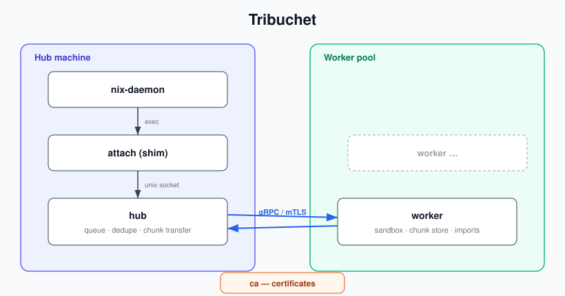

# tribuchet — remote build execution for Nix

RBE-style remote builder service driven by Nix's experimental
`external-builders` feature. A shim on the client machine receives the
build environment from Nix as JSON, forwards it to a local hub, which
schedules the build on a remote worker that executes the builder inside
its own sandbox.

## Why not the build-hook / `--builders` protocol?

The classic remote build protocol requires SSH reachability, nix on every
worker, and copies the full closure each time without a scheduler. The
external-builders interface gives us the complete, already-rewritten build
environment (builder, args, env, input closure, scratch output paths) and
lets us own transfer, scheduling, and execution.

## Key insight: scratch paths are identical on both sides

Nix hands the external builder *scratch* output paths and expects them to
be populated on exit. The worker sandbox writes to the very same scratch
paths; the shim unpacks the returned NARs at those paths unchanged. Nix
then performs self-reference rewriting, hashing, and registration itself.
No store-path rewriting in tribuchet and no drvPath needed. Workers run a
nix-daemon of their own: inputs are imported through it (AddToStoreNar),
so they are registered in the worker's Nix database and protected from
GC by per-build temp roots. The worker must be a trusted daemon user
(imports skip signature checks; transport authenticity comes from mTLS).

## Components (single binary, subcommands)

## Build flow

1. Nix invokes `tribuchet attach <build.json>`. The shim parses build.json
   (version 1: builder, args, env, inputPaths, outputs, system, topTmpDir,
   tmpDirInSandbox) and submits a build request to the hub over a unix
   socket, followed by a zstd tar of its own `topTmpDir`: structured
   attrs / `passAsFile` place files there that env refers to via
   `tmpDirInSandbox` (`/build/.attrs.json` etc.). The hub only buffers
   and forwards that archive. It never reads client directories off
   disk.
2. Hub validates the request (store dir pinned to `/nix/store`, store-path
   basenames restricted to Nix's name charset, absolute builder,
   `tmpDirInSandbox` pinned to `/build`, no duplicate or input-aliasing
   outputs, tmp dir archive size capped) and dedupes by a hash of the
   request. Nix derives the scratch outputs deterministically from
   the drvPath, so submissions of the same derivation hash identically:
   a matching request attaches to the in-flight build's log and result,
   while a *different* request claiming an in-flight scratch path is
   rejected.
   Otherwise it queues the request for a worker matching `system` (and
   later: required features). A system no connected worker serves is
   rejected immediately; otherwise submitters block and Nix's max-jobs
   bounds parallelism.
3. Staging: the assignment carries the input closure, with a manifest
   (Nix db metadata plus chunk list) inline for paths the hub has
   chunked before and does not know the worker to have. The worker asks
   its nix-daemon (taking temp roots so GC cannot race the build) and
   answers with one Need: the paths it lacks and the chunks its store
   lacks. The hub streams manifests for those paths as it computes them
   and the chunks of every Need (see Chunked staging).
4. Worker imports missing inputs through its nix-daemon (which verifies
   the NAR hash and registers the path), constructs the sandbox, and
   executes `builder args…` with the env from build.json, cwd
   `/build`. Logs stream back live through hub to the shim's stdout/stderr
   (Nix shows them as ordinary build output).
5. On success the worker chunks every scratch output's NAR (bounded in
   size and by the build deadline) and announces the chunk manifests.
   The hub requests the chunks its cache lacks and assembles each NAR,
   checking every chunk's BLAKE3 against the manifest as it relays. The shim unpacks into a temp
   path next to each scratch path and renames into place only after the
   verified end-of-stream event, then exits 0. Builder failure ⇒ shim
   exits with the builder's status; Nix reports a normal build failure.

## Sandbox

We re-implement the sandbox rather than driving builds through the
worker's Nix (its daemon serves only as the input store).
Reference implementations: `nix/src/libstore/unix/build/` and
`nix/src/libstore/darwin/build/sandbox-defaults.sb`.

* Linux: `unshare(CLONE_NEWUSER|NEWNS|NEWPID|NEWIPC|NEWUTS)` (plus NEWNET
  unless fixed-output), then a fork so the builder execs as PID 1 of the
  new PID namespace — its death kills every descendant, so daemonized
  builder children cannot outlive the build. Input paths are bind-mounted
  read-only (`MS_NOSUID|MS_NODEV`) at their store paths inside a private
  root, scratch outputs are created in a writable store dir, the shipped
  tmp dir is bind-mounted at `tmpDirInSandbox`, minimal `/dev` (nodes,
  `/dev/shm` tmpfs, devpts), fresh `/proc`, loopback brought up, stub
  `/etc/passwd`, then `pivot_root` + detach of the old root. The uid is
  remapped via the user namespace (no separate build uid yet). When the
  worker's cgroup is delegated (systemd `Delegate=yes`), each build runs
  in its own cgroup with an optional `memory.max`, torn
  down via `cgroup.kill`. `--sandbox-bin-sh` binds a static shell at
  `/bin/sh` like Nix's busybox sandbox path. Builds requiring the
  `uid-range` system feature get a disjoint 65536-uid block (Nix's
  auto-allocate-uids scheme, root worker required), run as in-namespace
  root, and see their own delegated cgroup subtree at `/sys/fs/cgroup`
  — enough for systemd-nspawn inside the sandbox. `--emulate
  system=/path/to/static-qemu` advertises foreign systems; such builds
  get the emulator bound into the sandbox and registered in a per-userns
  binfmt_misc instance (kernel 6.7+); a nested user namespace drops the
  registration-time root back to uid 1000 for the build. On root
  workers with `/dev/net/tun`, fixed-output builds get a private
  network namespace with user-mode NAT (the embedded
  [presto-pasta](https://github.com/Mic92/presto-pasta) datapath, run
  by a helper process that drops to an unprivileged uid) instead of
  the host namespace: host abstract sockets and loopback services are
  unreachable. The worker's `[fod-network]` setting adds an ordered
  allow/deny rule list (destination CIDR or the `private` keyword,
  protocol, ports/port ranges; first match wins) evaluated for every
  outbound connection of such builds.
* macOS: no mount namespace, but inputs already live at their real
  /nix/store paths thanks to the daemon import. The worker leases each
  build to a per-uid agent (`tribuchet agent`, a socket-activated
  launchd daemon running as one of the `_tribuchetbldN` build users):
  the agent unpacks the shipped tmp dir into its own scratch dir,
  which becomes the cwd, and env values referencing the hub's
  `tmpDirInSandbox` (e.g. `/build` from a Linux hub) are rewritten to
  it, so no symlink is created at a hub-chosen path. The agent applies
  a deny-default Seatbelt profile via `sandbox_init_with_parameters`
  before exec'ing the builder, modeled on Nix's `sandbox-defaults.sb`
  (reads stay permissive; writes are scoped to the scratch dir,
  outputs, and specific device nodes; signals are limited to the
  sandbox). The agent and its builder share a uid, so the profile is
  the only wall between them: an escaped builder could tamper with its
  agent, but not with the worker or other builds. Since the agent, not
  the worker, owns the builder process, running builds survive worker
  restarts and are re-adopted.
* Fixed-output derivations are detected via the `outputHash` env var —
  or, under `__structuredAttrs`, inside the `__json` env blob — and get
  network access (no NEWNET on Linux, network allowance in the macOS
  profile).

Accepted tradeoffs: no recursive-nix, sandbox parity is ours to maintain,
trusted worker pool assumed (output authenticity rests on the
authenticated transport).

## Security

* Transport: mTLS by default; `tribuchet ca` issues the CA and
  per-worker certs (finite validity: 10y CA, 2y leaves; no revocation
  yet — rotate the CA if a worker key leaks). With `auth =
  "tailscale"` the listener runs plaintext and the hub asks
  tailscaled's LocalAPI `whois` for the peer's node name and ACL tags
  on each session, so WireGuard provides confidentiality/integrity
  and the tailnet provides identity (optionally gated to
  `tailscale-allowed-tags`).
* Output authenticity comes from the authenticated worker session
  (mTLS or tailnet identity). The hub checks every output chunk against
  the worker's manifest, the client's Nix computes narHash on import.
* The attach socket is group-restricted to `nixbld` (the hub refuses to
  start without that group). Request validation pins every client-chosen
  path.
* The worker validates everything the hub sends (build ids, store paths,
  builder, sandbox dir) before using it in filesystem operations — a
  compromised hub does not get filesystem primitives on workers.

## Scale & state

MVP targets 2–10 workers and a few clients: all scheduler state is in
memory (no database). The hub's replay buffer is capped at 256 MiB per
build and slow dedupe subscribers are dropped rather than buffered.

### Chunked staging

A manifest is a path's FastCDC chunk boundaries and BLAKE3 hashes; the
worker answers with the chunks it lacks and only those are transferred.
Warm workers skip most bytes this way and re-staging a cached closure
costs one round trip. The hub remembers per session which paths a
worker has, so repeat builds carry bare path names only.

Both sides back this with an on-disk chunk store (hub:
`chunk-cache-bytes`, worker: `chunk-store-bytes`, 10 GiB default): append-only packs with S3-FIFO eviction, chosen over LRU
because cold stagings are one-hit-wonder scans. The store is never a
source of truth — a lost or corrupt chunk costs a re-transfer and the
daemon's NAR-hash check backstops correctness, so the whole directory
can be deleted at rest. A chunk evicted before use is requested again.

Hub restarts cancel nothing, without any state handoff: on SIGTERM the
hub exits immediately and the replacement reconstructs its state from
the edges. Workers re-register and announce the dedupe keys of builds
they still hold (running, or finished but undelivered); attach clients
reconnect and resubmit the identical request, whose deterministic
dedupe key routes it back to the worker holding the build, which
resumes (or just re-delivers the finished result) instead of building
again.

Worker redeploys are plain unit restarts: builds run under the
per-uid agent services, which hold the log and exit status until a
worker collects them, and resume state is persisted in the build
dirs. The replacement worker re-adopts running builds from their
agents, supervises them to completion and redelivers finished
results. The hub covers the
session gap by requeueing instead of failing jobs whose worker
session died; the attached client sees a pause, not an error. A full
stop behaves the same way: builds keep running, and their results
wait on disk until a worker starts again (or expire undelivered).

## Known limitations (MVP)

* Workers run up to `max-jobs` concurrent builds over one session.
* The hub's tmp-dir tar and the worker's unpack walk their trees
  through directory fds with O_NOFOLLOW, but NAR pack/unpack go through
  harmonia-file-nar, which resolves paths; output packing therefore
  trusts that nothing rewrites the finished build's output tree while
  it is being packed (builds run under disjoint uids, so only root or
  the same build could).
* Stopping the worker does not stop its running builds (KillMode=
  process); an operator who wants them gone must kill the build
  cgroups too.
* Results are kept until the hub acknowledges them, but log replay
  offsets advance when a chunk is handed to the session, so a few log
  lines in flight when a session dies are skipped on resume.
* Cancellation is lazy: a dispatched build whose attach clients are
  all gone is killed only after a grace period, and an abandoned
  queued job is dropped when a worker would have picked it up, not
  immediately.
* Dedupe attaches duplicates to the first attempt, so a transient
  failure propagates to all attached submitters (same as Buck2's RE
  dedupe behaviour).
* The Linux builder keeps the worker's kernel uid (remapped in the user
  namespace); there is no dedicated unprivileged build user yet.
* Input NARs are not verified against an expected content hash; the
  worker trusts the mTLS-authenticated hub for input content.

## Deployment

Hub and worker read their settings from TOML config files
(`--config`, default `/etc/tribuchet/{hub,worker}.toml`); only the
one-shot `attach` and `ca` commands take their parameters on the
command line. `nixosModules.default` ships hub and worker services
(`services.tribuchet-hub`, `services.tribuchet-worker`): the hub is
socket-activated, the worker unit delegates its cgroup subtree for
per-build limits and restarts on package bumps and settings changes
while running builds keep going (KillMode=process plus re-adoption).
The e2e test consumes the same module. macOS hosts use the
`darwinModules.default` nix-darwin module, which ships both services:
the hub adopts its listeners from launchd (`launch_activate_socket`,
the analogue of the socket-activated NixOS unit), the worker's
launchd daemon execs a stable symlink that activation flips before
restarting the daemon, and one socket-activated agent daemon per
build user runs the builds. Both hub and worker run as the
unprivileged `_tribuchet` user.
