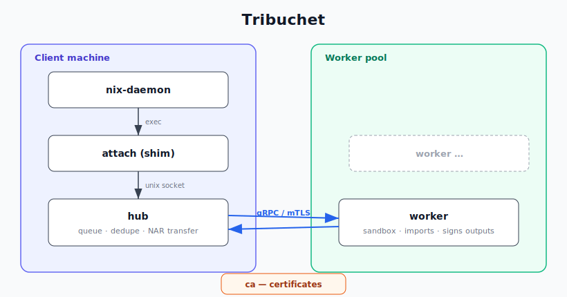

# Tribuchet

Remote build execution for Nix, built on the experimental
`external-builders` feature: a hub next to the nix-daemon hands builds
to remote workers, which run them in their own sandboxes and stream
logs and outputs back to the waiting `nix build`.



> **Status: experimental.** It depends on Nix's experimental
> `external-builders` feature (plus a small patch for uid-range builds)
> and the protocol and configuration may still change.

## Why not `--builders` / the SSH build hook?

The classic remote build protocol needs SSH reachability into every
builder, Nix installed there, and copies closures without scheduling.
tribuchet receives the complete build environment from Nix and owns
transfer, scheduling, and execution itself.

## Features

- Workers dial the hub over gRPC with mutual TLS, so they can sit
  behind NAT and register the systems and features they serve.
- Hub scheduling with per-system queues and capability matching
  (`kvm`, `uid-range`, `big-parallel`, …); identical submissions share
  one build.
- Only missing input paths travel, as zstd-compressed NARs; outputs
  come back as worker-signed (ed25519) NARs with no store-path
  rewriting.
- Builds survive hub and worker restarts/reloads, so deploys don't
  kill in-flight builds; they're cancelled when the client goes away.
- Sandboxing equivalent to Nix's own (Linux namespaces + per-build
  cgroup limits, macOS `sandbox-exec`), plus `uid-range` builds and
  cross-system user-mode emulation.
- Fixed-output derivations get network through [pasta] in an otherwise
  isolated network namespace.
- Live build logs across reloads/restarts, with max-log-size,
  max-silent-time, and timeout enforcement.
- NixOS and nix-darwin modules for both services.

[pasta]: https://passt.top/

## Getting started

tribuchet is one binary with four subcommands: `hub`, `worker`,
`attach` (the shim Nix execs), and `ca`.

### 1. Certificates

Workers authenticate to the hub with client certificates from a
private CA:

```console
$ tribuchet ca init   --dir ./ca
$ tribuchet ca issue hub     --dir ./ca   # SAN must match the hub address workers dial
$ tribuchet ca issue worker  --dir ./ca   # one per worker
```

The hub reads `ca/{hub.crt,hub.key,ca.crt}` from `<config-dir>/ca`
(default `/etc/tribuchet/ca`); each worker gets `ca.crt` plus its own
key pair (default `/var/lib/tribuchet/tls/`).

Alternatively, set `auth = "tailscale"` on both sides to skip TLS
entirely: the worker dials `http://<hub-tailnet-name>:7437`, the hub
looks the peer up against tailscaled's LocalAPI on each connection
(so anything not on the tailnet is rejected) and uses the node name
as the worker identity. Gate registration to specific ACL tags with
`tailscale-allowed-tags = ["tag:tribuchet-worker"]`.

### 2. Hub (on the machine running nix-daemon)

`/etc/tribuchet/hub.toml`:

```toml
socket = "/run/tribuchet/hub.sock"   # for tribuchet attach
listen = "0.0.0.0:7437"              # for workers
config-dir = "/etc/tribuchet"
```

Point Nix at the attach shim in `nix.conf`:

```
experimental-features = external-builders
external-builders = [{"systems":["x86_64-linux","aarch64-linux"],"program":"/path/to/tribuchet-attach"}]
```

where `tribuchet-attach` is a wrapper script:

```sh
#!/bin/sh
exec tribuchet attach "$1" --socket /run/tribuchet/hub.sock
```

Optionally pin worker signing keys in
`/etc/tribuchet/trusted-signing-keys` (one `name:base64` per line, same
syntax as `trusted-public-keys`).

### 3. Workers

Workers need a running nix-daemon of their own (inputs are imported
through it and protected from garbage collection by temp roots).

`/etc/tribuchet/worker.toml`:

```toml
hub = "https://hub.example.org:7437"
max-jobs = 4
max-log-size = 67108864

[emulate]
aarch64-linux = "/path/to/static/qemu-aarch64"
```

```console
$ tribuchet worker --config /etc/tribuchet/worker.toml
```

The full set of options for both files is documented in
[`crates/tribuchet/src/config.rs`](crates/tribuchet/src/config.rs).

### NixOS

Import `tribuchet.nixosModules.default` (flake input
`github:Mic92/tribuchet`) and enable the services:

```nix
{
  # hub machine
  services.tribuchet-hub.enable = true;
  # optional: route this machine's nix-daemon builds through the hub
  services.tribuchet-hub.externalBuilders = {
    enable = true;
    systems = [ "x86_64-linux" "aarch64-linux" ];
  };

  # worker machines
  services.tribuchet-worker = {
    enable = true;
    settings = {
      hub = "https://hub.example.org:7437";
      max-jobs = 4;
    };
  };
}
```

The hub unit is socket-activated; the worker unit reloads instead of
restarting on package or settings changes, so running builds survive
deploys.

### macOS (nix-darwin)

`tribuchet.darwinModules.default` provides the same two services for
launchd: the hub adopts its sockets from launchd, the worker daemon
execs through a stable symlink that activation flips and SIGHUPs, again
keeping builds alive across upgrades.

## How a build flows

1. Nix execs `tribuchet attach build.json`; the shim submits the build
   to the hub over the unix socket.
2. The hub validates and dedupes the request, queues it for a worker
   serving that system and feature set.
3. Path negotiation: the worker reports which input paths it already
   has; the hub streams the missing ones as zstd NARs with their Nix db
   metadata, imported on the worker through its nix-daemon.
4. The worker runs the builder in its sandbox; logs stream live back to
   the client.
5. Outputs are packed, signed, verified by the hub, and unpacked at the
   scratch paths Nix provided; Nix finishes hashing and registration as
   if the build had run locally.

[`DESIGN.md`](DESIGN.md) describes the architecture, sandbox, security
model, and failure handling in detail.

## Development

```console
$ nix develop            # rust toolchain + protobuf
$ cargo test
$ cargo clippy --all-targets
$ nix build .#checks.x86_64-linux.nixos-test   # end-to-end VM test (hub + worker)
```

The VM test exercises remote builds, hub/worker restarts and reloads
mid-build, cancellation, log limits, uid-range and emulated builds, and
fixed-output networking.

## License

[MIT](LICENSE)
